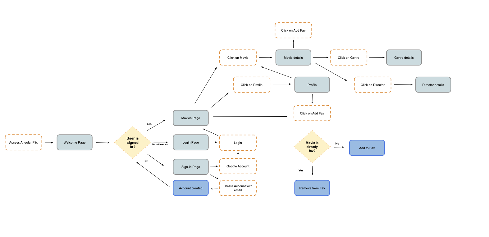

# MyFlixAngularClient

## Project description

This project is a client-side of myFlix app built using Angular, and was created to show movies using [Movie API](https://github.com/AfonsoRD/movie_api).

This project was generated with [Angular CLI](https://github.com/angular/angular-cli) version 15.2.6.

## **Key Features**

#### **Welcome View**

- Allows users to log in with a username and password
- Allows new users to register (username, password, email, date of birth)

#### **Main View**

- Returns a list of ALL movies to the user
- Ability to select a movie for more details as Genre, Director and Synopsis
- Ability to navigate to Profile view
- Ability to add/remove each movie into/from the favorite movies list by clicking the heart-shaped button.
- Ability to navigate to the profile view through Navigation bar.

#### **Single Movie View**

- Returns data (description, genre, director, image) about a single movie to the user

#### **Profile view**

- Displays user registration details
- Allows users to update their info (username, password, email, date of birth)
- Displays favorite movies
- Allows users to remove a movie from their list of favorites
- Allows existing users to deregister

---

### User Stories

- As a user, I want to be able to login or register, so that I can have my account and watch movies.
- As a user, I want to be able to see a profile view, so that I can have all my details, sign out, deregister and see my favorite movies.
- As a user, I want to be able to see all the movies, so that I can have an overview.
- As a user, I want to be able to see the genre view, so that I can have a brief description about the genre
- As a user, I want to be able to see a Director’s view, so that I can now who is the Director and where he/she born.
- As a user, I want to be able to see the details about the movie, so that I can now more about the director, genre and read the synopsis.
- As a user, I want to be able to read the project dependencies and features, so that I can run locally the app and see the code.

### User Flow



#### Technical Dependencies

- AngularJS
- Angular Material
- Node.js/ npm
- TypeDoc
- Github Pages

#### Dependencies

The `App` component requires the following dependencies to be installed:

```json
    "@angular/animations": "^15.2.0",
    "@angular/cdk": "^15.2.7",
    "@angular/common": "^15.2.0",
    "@angular/compiler": "^15.2.0",
    "@angular/core": "^15.2.0",
    "@angular/forms": "^15.2.0",
    "@angular/material": "^15.2.7",
    "@angular/platform-browser": "^15.2.0",
    "@angular/platform-browser-dynamic": "^15.2.0",
    "@angular/router": "^15.2.0",
    "rxjs": "~7.8.0",
    "tslib": "^2.3.0",
    "zone.js": "~0.12.0"
```

## Getting Started

## Development server

Run `ng serve` for a dev server. Navigate to `http://localhost:4200/`. The application will automatically reload if you change any of the source files.

## Code scaffolding

Run `ng generate component component-name` to generate a new component. You can also use `ng generate directive|pipe|service|class|guard|interface|enum|module`.

## Build

Run `ng build` to build the project. The build artifacts will be stored in the `dist/` directory.

## Running unit tests

Run `ng test` to execute the unit tests via [Karma](https://karma-runner.github.io).

## Running end-to-end tests

Run `ng e2e` to execute the end-to-end tests via a platform of your choice. To use this command, you need to first add a package that implements end-to-end testing capabilities.

## Further help

To get more help on the Angular CLI use `ng help` or go check out the [Angular CLI Overview and Command Reference](https://angular.io/cli) page.

###### [myFlix-Angular-Client](https://afonsord.github.io/myFlix-Angular-client/)
